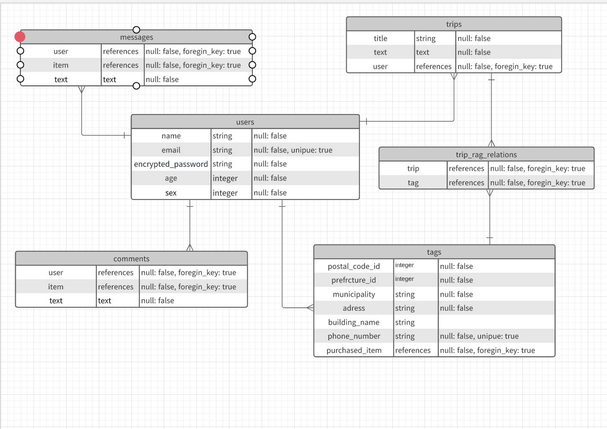

# README

## アプリケーション名
Trippy

## 概要
旅行先で撮った写真の投稿・管理ができるサービスです。
このアプリは旅行にいく方だけではなく、これから旅行にいく方やいつか行きたいので情報収集したい方にお使いいただくものです。

## 目指した課題解決
・旅行の行先やプランを決めるために若い人が使用するインスタグラムでは旅行以外の投稿も混ざっているのでピンポイントで探しづらい
→漠然と「友人と近場で温泉でゆっくりしたい」、「東南アジアのリゾートに行きたい」などのイメージから旅行先を決めることも多いと思いますが、このアプリケーションでは検索機能が国別、地域別、カテゴリー別に分かれているので自分の希望に合った条件で簡単に検索できます。

・よく旅行にいく人が旅行の記録を残す専用ツールが欲しい（現在はFacebookやInstagramを利用している人が多い）
→旅行に行った写真をまとめて管理することで思い出の詰まったアルバムをいつでも閲覧することができます。

## アプリケーションの機能一覧
・ユーザー管理機能
・複数画像投稿機能
・画像プレビュー表示機能
・投稿編集機能
・投稿削除機能
・タグ検索機能
・コメント機能
・メッセージ機能
・逐次検索機能
・パンくずリスト
・画像をスライドショー表示
・いいね機能
・旅行プランの記録（ルート）
・行先ランキング表示機能
・旅行ごとにアルバムにまとめて管理する機能

## データベース設計

## 実装予定の機能
・タグ検索機能
・コメント機能
・メッセージ機能
・逐次検索機能
・パンくずリスト
・画像をスライドショー表示
・いいね機能
・旅行プランの記録（ルート）
・行先ランキング表示機能
・旅行ごとにアルバムにまとめて管理する機能

## 利用方法
閲覧は誰でも可能です。
投稿する場合や他のユーザーの投稿にコメントをしたりメッセージを送りたい場合にはユーザー登録が必要です。

## 使用技術
■フロントエンド
●HTML
●CSS
●Bootstrap4
●JavaScript(jQuely)

■バックエンド
●Ruby 2.6.5
●Ruby on Rails'6.0.0'

■その他
●Git/GitHub
●MySQL
●VSCode

